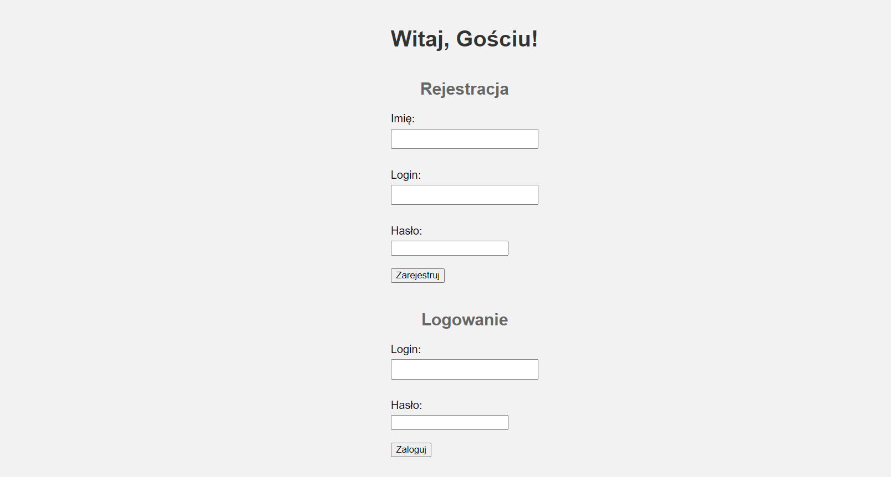
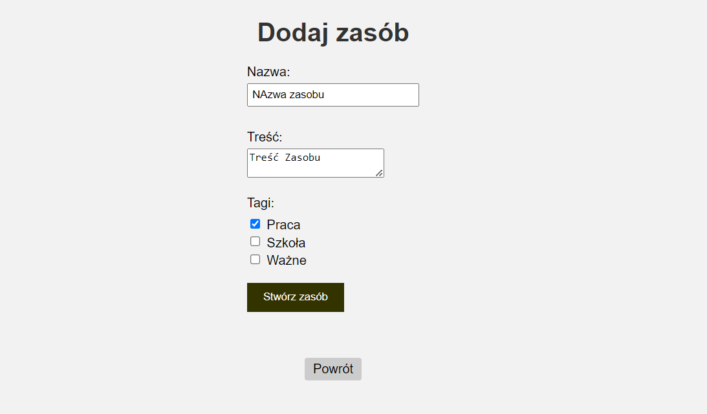
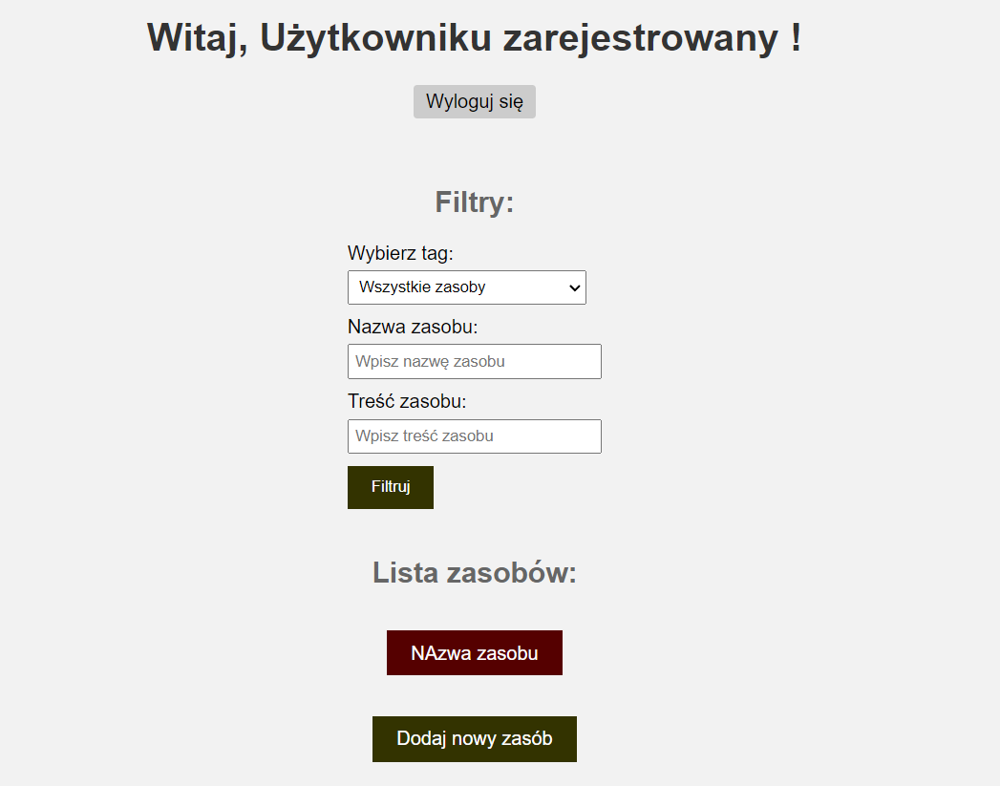
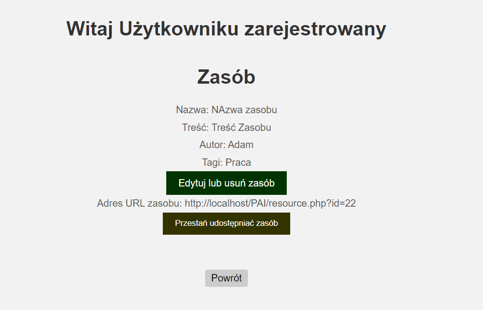
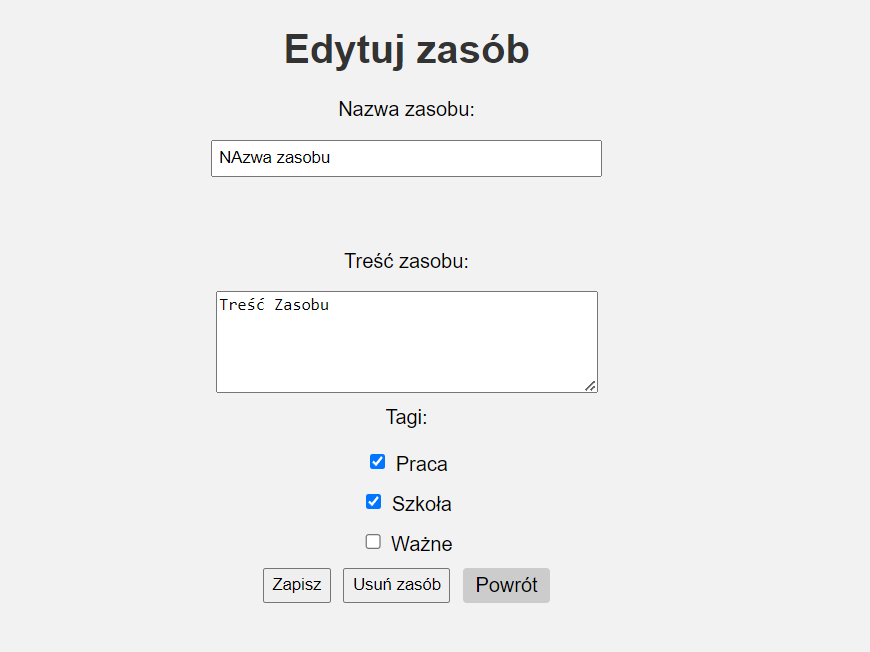

# Projekt zaliczeniowy na laby z Podstaw Aplikacji Internetowych

Wymagania projektu są opisane w [Wymagania](WymaganiaProjektu.pdf)

W pliku pai.sql jest przkładowa baza danych.

# Wygląd projektu:
- Ekran główny (logowania i rejestracji)

- Ekran tworzenia zasobu

- Ekran główny zalogowanego użytkownika

- Ekran przeglądania zawartości zasobu, po udostępnieniu zasobu inne osoby mogą posiadając link również przeglądać ten zasób

- Ekran edycji i usuwania zasobu

